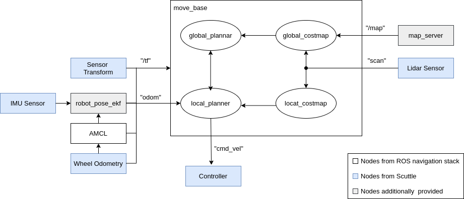
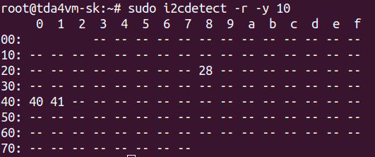
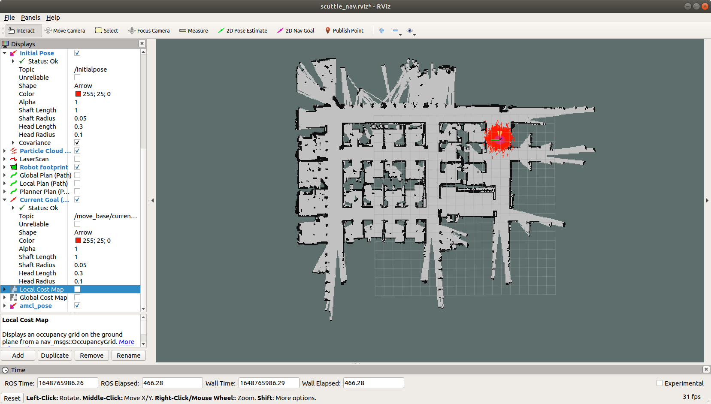

Lidar based Navigation
======================

# Demo details

## Goal

The goal of the demo is to demonstrate the following key aspects:

1. Scan the scene using a 360&deg; 2-D Lidar sensor, RPLidar A1. 
2. Estimate the change of a robot's pose by fusing the data from a wheel encoder and an IMU sensor, BNO055. 
3. Run the ROS navigation stack for a robot to move from a location A, i.e., initial pose, to a location B, i.e., navigation goal, autonomously on a pre-built map, which is also created using the same 2-D Lidar sensor. 

The robot shall operate with the following constraints placed on the environment:
1. The demonstration is restricted to indoor environment.
2. The ground plane is expected to be flat and free of any bumps.
3. A RPLidar A1 shouldn't be blocked by any other sensors and structures on a robot where the Lidar sensor is mounted. Any obstacle should be taller than the height of the Lidar sensor.

## Demo Description

This demo is based on [ROS navigation stack](http://wiki.ros.org/navigation) with the RPLidar sensor, the wheel encoder and the IMU sensor. Figure 1 shows the overall block diagram of the navigation system. It consists of 

1. [AMCL localization](http://wiki.ros.org/amcl?distro=noetic) and [move_base](http://wiki.ros.org/move_base?distro=noetic) nodes provided by ROS navigation stack.
2. A Lidar sensor, an IMU sensor, the transforms between the sensors, a wheel odometry and a controller. They are mounted on or provided by the SCUTTLE robot.
3. [robot_pose_ekf](http://wiki.ros.org/robot_pose_ekf) to improve localization by fusing wheel odometry and IMU. 
4. Map server to provide a global map.  


<figcaption>Figure 1. SCUTTLE Navigation.</figcaption>
<br />

## Hardware and Software Setup

The following setup is necessary for this demo:

1. SCUTTLE robot with fully charged battery pack powering the onboard DC motors.
2. A working J721e SK board, E2 revision or higher, securely mounted on the SCUTTLE platform. 
   1. Appropriate GPIO connections from the SK board to the SCUTTLE motor control board.
   2. The SD card flashed with the latest stable EdgeAI SDK with Robotics SDK optionally setup.
3. A IMU sensor secured to the SCUTTLE platform and connected to the SK board through appropriate GPIO connections.
4. Fully charged power supply for powering the SK board and a USB Hub, through which the Lidar sensor is connected to the SK board.
5. A RPLidar A1 sensor secured to the front of the SCUTTLE platform and connected to the USB port of the SK board through the USB Hub. 
6. A compatible WiFi card with antennae installed on the SK board. The antennae must be secured so that no accidental damage to either the WiFi card, antennae, or the SCUTTLE robot is done.

## Setting up the Demo

It is expected that the edgeai-robotics-demos repository has been cloned and the pre-requisites have been installed as described in [edgeai-robotics-demos](../../../README.md). The Docker environment for the Robotics demos shuold be set up by following the instruction on [Running the demos under Robotics SDK Docker based ROS environment](../../../ros1/README.md). The Docker container for the Robotics demo (j7-ros-noetic-scuttle) is built on top of the J7 ROS1 Docker container (j7-ros-noetic).

### IMU Sensor Driver 

The BNO055 IMU is used for the improved odometry by fusing IMU and wheel odometry. To set up the IMU sensor, it is needed to solder the pins to the BNO055. Then make the following connection between the BNO055 and the J721e SK board.

* Connect BNO055 Vin to pin 1 (3.3V) of the J721e SK board.
* Connect BNO055 GND to pin 9 (GND) of the J721e SK board.
* Connect BNO055 SDA to pin 3 (SDA) of the J721e SK board.
* Connect BNO055 SCL to pin 5 (SCL) of the J721e SK board.

The following command can verify that the BNO055 IMU sensor can be accessible.

``` shell
root@tda4vm-sk:/opt/robot# sudo i2cdetect -r -y 10
```
Note that 10 is a i2c bus number. Check that it has an address of 0x28 as shown in below:



<figcaption>Figure 2. i2cdetect output.</figcaption>
<br />


In addition, a ROS driver for the BNO055 IMU sensor is required to calibrate and launch the sensor. Make sure that it has been cloned in the `/opt/robot/ros-imu-bno055` directory. For more information on this ROS driver, refer to [ros-imu-bno055](https://github.com/dokkwon/ros-imu-bno055).

### Synchronization between J7 SK Board and Ubuntu PC

While the navigation stack is running on the SK board, it subscribes the 2D pose estimate topic and the 2D navigation goal topic to get the robot's initial pose and the navigation goal, which are published from the remote Ubuntu PC using RViz. Therefore, two machines should be time synchronized.

When the remote Ubuntu PC and the SK board are connected to internet, they can be synchrnoized to each other automatically. Otherwise, we use `chrony` to synchronized them by the following steps. In the example below, it is assumed that `192.163.43.20` and `192.163.43.1` are the IP addresses of the Ubuntu PC and the SK board, respectively. They should be replaced by the actual PC and J7 IP adresses.

#### Ubuntu PC 

In the Docker container on the Ubutu PC, which is a server, update /etc/chrony/chrony.conf.

``` shell
# Server
# PC IP ADDR is 192.168.43.20
# It should be updated depedning on PC IP ADDR
server 192.168.43.20 iburst 
 
# This directive specify the location of the file containing ID/key pairs for
# NTP authentication.
keyfile /etc/chrony/chrony.keys
 
# This directive specify the file into which chronyd will store the rate
# information.
driftfile /var/lib/chrony/chrony.drift
 
# Uncomment the following line to turn logging on.
#log tracking measurements statistics
 
# Log files location.
logdir /var/log/chrony
 
# For local server setting
# SK IP ADDR is 192.168.43.1.
# It should be updated depending on SK board IP ADDR
local stratum 8
manual
allow 192.168.43.1
 
# Stop bad estimates upsetting machine clock.
maxupdateskew 100.0
 
# This directive enables kernel synchronisation (every 11 minutes) of the
# real-time clock. Note that it can’t be used along with the 'rtcfile' directive.
rtcsync
 
# Step the system clock instead of slewing it if the adjustment is larger than
# one second, but only in the first three clock updates.
makestep 1 3
```

Then we have to start `chrony`. These processes can be done by running the following script.

``` shell
user@pc:~/j7ros_home$ ros_ws/src/edgeai-robotics-demos/docker/run_pc.sh
root@pc-docker:~/j7ros_home/ros_ws$ /opt/robot/edgeai-robotics-demos/scripts/timesync.sh
```

#### J7 SK BOARD 

In the Docker container on the SK board, which is a client, update /etc/chrony/chrony.conf.

``` shell
# Server
# PC IP ADDR is 192.168.43.20
# It should be updated depedning on PC IP ADDR
server 192.168.43.20 iburst
 
# This directive specify the location of the file containing ID/key pairs for
# NTP authentication.
keyfile /etc/chrony/chrony.keys
 
# This directive specify the file into which chronyd will store the rate
# information.
driftfile /var/lib/chrony/chrony.drift
 
# Uncomment the following line to turn logging on.
#log tracking measurements statistics
 
# Log files location.
logdir /var/log/chrony
 
# Stop bad estimates upsetting machine clock.
maxupdateskew 100.0
 
# This directive enables kernel synchronisation (every 11 minutes) of the
# real-time clock. Note that it can’t be used along with the 'rtcfile' directive.
rtcsync
 
# Step the system clock instead of slewing it if the adjustment is larger than
# one second, but only in the first three clock updates.
makestep 1 3
```

Then we have to start `chrony` and sync with the Ubuntu PC. These processes can be done by running the following script.

``` shell
root@tda4vm-sk:/opt/robot/edgeai-robotics-demos/docker# ./run.sh
root@j7-docker:~/j7ros_home/ros_ws$ export PC_IP_ADDR=192.168.43.20
root@j7-docker:~/j7ros_home/ros_ws$ /opt/robot/edgeai-robotics-demos/scripts/timesync.sh
```

If the two mahcines are synchronized, you will see the following line in the output message. 
``` script
Leap status     : Normal
```

Otherwise, you have to do run the script again.


## Building the Demo

To build the Lidar navigation demo, run the following commands:

```shell
root@tda4vm-sk:/opt/robot# edgeai-robotics-demos/docker/run.sh
root@j7-docker:~/j7ros_home/ros_ws$ mkdir -p ros1_build
root@j7-docker:~/j7ros_home/ros_ws$ cd ros1_build
root@j7-docker:~/j7ros_home/ros_ws/ros1_build$ catkin_make --source /opt/robot
root@j7-docker:~/j7ros_home/ros_ws/ros1_build$ source devel/setup.bash
```

## Running the Demo

**[J7 SK BOARD]**

Turn on the power to the motors, then launch the Lidar navigation,

```shell
root@j7-docker:~/j7ros_home/ros_ws$ roslaunch lidar_navigation lidar_navigation.launch
```

The followings are specified in lidar_navigation.launch:

1. Static transforms between frames, e.g., `base_footprint` and `imu`, `base_footprint` and `base_link`, and `lidar_1` and  `base_scan`. Note that the transform between `base_footprint` and `imu` should be set based on the mounting poistion of the IMU sensor.
2. Map file. A robot will navigates from two points on this global map (See Figure 1) and it should be created in advance. Please refer to [Build the Map](README_MapBuild.md) to learn how to create the map. 
3. [IMU](https://github.com/dokkwon/ros-imu-bno055) launch file.
4. [robot_pose_ekf](http://wiki.ros.org/robot_pose_ekf) node launch parameters.
5. [AMCL localization](http://wiki.ros.org/amcl?distro=noetic) launch file.
6. [move_base](http://wiki.ros.org/move_base?distro=noetic) launch file. The move_base package needs to configure multiple configuration YAML files. They may need to be modified depending on a robot, a global map, safety requirement and so on. They include, for example,
   1. costmap_common_params.yaml
   2. local_costmap_params.yaml
   3. global_costmap_params.yaml
   4. base_local_planner_params.yaml
   5. dwa_local_planner_params.yaml
   6. move_base_params.yaml
7. RPLidar launch file
8. Robot description file. The robot description file for the SCUTTLE robot is provided. However, it should be updated depending on a Lidar sensor's mounting position.
9. Path to the scuttle_driver package to control the SCUTTLE robot and pulish TF and odometry information.

For overall information on ROS navigation stack, please refer to [here](http://wiki.ros.org/navigation).


**[Ubuntu PC]**

To start autonomous navigation, the robot's initial pose estimate and the goal position should be specified. They can be specified from RViz on Ubuntu PC. Run the following command to launch RViz.

``` shell
user@pc:~/j7ros_home$ ros_ws/src/edgeai-robotics-demos/docker/run_pc.sh
root@pc-docker:~/j7ros_home/ros_ws$ rviz -d /root/j7ros_home/ros_ws/src/edgeai-robotics-demos/ros1/rviz/lidar_navigation.rviz 
```

From the RViz tool bar as shown in Figure 1, click the **2D Pose Estimate** button, and select the initial pose on the map. Then click **2D Nav Goal** and selecte the goal on the map. 


<figcaption>Figure 2. RViz window for the navigation demo.</figcaption>
<br />

To kill the demo, hit `CTRL-C` on the terminal and the motors should stop. Switch off the power supply to the motors to
conserve the battery.

## Waypoints Navigation

Instead of selecting the robot's initial pose estimate and a single goal position manually using the RViz on the Remote PC, it is also possible to set multiple waypoints for a robot to navigate through as well as the initial pose automatically. To run the demo in the waypoints navigation mode, do the followings in the J7 Docker container.

In one command window, launch the Lidar navigation launch file. 

```shell
root@j7-docker:~/j7ros_home/ros_ws$ roslaunch lidar_navigation lidar_navigation.launch
root@j7-docker:~/j7ros_home/ros_ws$ roslaunch lidar_navigation waypoints_navigation.launch
```

Then open another command window, launch the waypoints navigation launch file. 
```shell
root@j7-docker:~/j7ros_home/ros_ws$ roslaunch lidar_navigation waypoints_navigation.launch
```

The following parameters should be specified in `waypoints_navigation.launch`.

1. `num_waypoints` The number of way points
2. `xy_goal_tolerance` The tolerance in meters for the controller in the x & y distance when achieving a goal. It is recommended to be identical to the same parameter for a local planner being used, e.g., `base_local_planner_params.yaml` or `dwa_local_planner_params.yaml`.
3. `yaw_goal_tolerance` The tolerance in radians for the controller in yaw/rotation when achieving its goal. It is recommended to be identical to the same parameter for a local planner being used, e.g., `base_local_planner_params.yaml` or `dwa_local_planner_params.yaml`. 
4. `waypoints_xyz` A sequences of (x, y, z) positions of the waypoints. 
5. `waypoints_yaw` A sequences of yaws of the waypoints.
