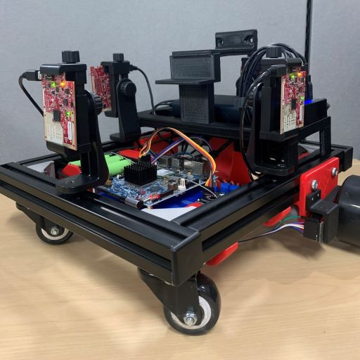

Radar Safety Bubble 
====================


This guide covers the process of setting up and running the Radar Safety Bubble Demo in ROS1 Noetic on the [SK-TDA4VM](https://www.ti.com/tool/SK-TDA4VM) and with the [SCUTTLE robot platform](https://www.scuttlerobot.org/). In this demo, point cloud data from four TI mmWave sensors is used with popular mapping and navigation libraries in the ROS environment to implement a safety bubble around the robot. The robot will move forward at a defined speed. When an obstacle is detected within the user defined slow zone bubble, the robot will slow down untill the obstacle has cleared the bubble. When an obstacle is detected within the user defined stop bubble, the robot will stop moving untill the obstacle has cleared the bubble.

Refering to Figure 1, the Radar Safety Bubble demo consists of several ROS nodes:
1. `ti_mmwave` node filters and publishes point cloud data from the mmWave sensor
2. `move_base` node uses the filtered point cloud data to populate local and global costmaps
3. `ti_safety_bubble` node calculates the range to detected obstacles and publishes velocity commands accordingly
4. `scuttle_driver` node handles motor control for the Scuttle robot
5. Rviz visualization of costmap and point cloud data is on a remote Ubuntu PC over WiFi connectivity


Figure 1. Radar Safety Bubble on the Scuttle robot: block diagram

## Hardware Requirements


Figure 2. TDA4VM and IWR6843ISK EVMs mounted on the Scuttle robot

Quantity | Item                        | Details
---------|-----------------------------|--------
1        | SCUTTLE                     | Robot platform
1        | TDA4VM SK Board             | Host machine
1 or 4   | mmWave EVM(s)               | [IWR6843ISK](https://www.ti.com/tool/IWR6843ISK#:~:text=IWR6843ISK%20is%20an%20easy%2Dto,and%20power%20over%20USB%20interface.)
1        | USB hub with external power | To expand the number of usb ports available to the host machine. Necessary for setups running 4 sensors
1        | Intel Wireless-AC 9260 M.2 WiFi module, and antenna |
1        | Battery pack with USB Type-C output to power the TDA4VM SK Board

## Setup

1. **Environment Setup**:

    First, set up the Robotics SDK by following the instructions [here](https://software-dl.ti.com/jacinto7/esd/robotics-sdk/08_02_00/docs/source/docker/README.html). The ROS1 Docker images must be built for both the TDA4 and the remote PC.

    **[TDA4]**

    Once the Robotics SDK ROS1 docker container is setup on TDA4, clone the radar-safety-bubble repository.
    ```
    root@tda4vm-sk:/opt/edge_ai_apps# mkdir -p /opt/robot && cd /opt/robot
    root@tda4vm-sk:/opt/robot# git clone -b scuttle https://git.ti.com/git/mmwave_radar/radar_safety_bubble_tda4.git radar-safety-bubble
    ```

    Run the following script on the TDA4VM host Linux.
    ```
    root@tda4vm-sk:~# bash /opt/robot/radar-safety-bubble/scripts/setup_script.sh
    ```

    **[Remote Ubuntu PC]**

    Once the Robotics SDK ROS1 docker container is setup on PC, clone the radar-safety-bubble repository:

    ```
    user@pc:~/j7ros_home$ mkdir -p safety_bubble_ws/src && cd safety_bubble_ws/src
    user@pc:~/j7ros_home/safety_bubble_ws/src$ git clone -b scuttle https://git.ti.com/git/mmwave_radar/radar_safety_bubble_tda4.git radar-safety-bubble
    ```

    Run the setup script.
    ```
    user@pc:~/j7ros_home/safety_bubble_ws/src$ bash radar-safety-bubble/scripts/setup_script.sh
    ```

2. **Docker Environment Setting**: Follow the instructions in this [docker setup guide for radar safety bubble](docs/radar_safety_bubble_docker_setup.md)

3. **Specify mmWave EVM serial port names**: Follow the instructions in this [serial port setup guide for radar safety bubble](docs/radar_safety_bubble_serial_ports_setup.md).

4. **Set up static transforms**: The position and angle of the sensors with respect to the `base_link` of the robot must be known. Measure the distance from the base link of the robot to each sensor and update the static transform arguments in the following launch files accordingly. Find more information on static transforms [here](http://wiki.ros.org/tf#static_transform_publisher).
    * single sensor setup:
        * `/opt/robot/radar-safety-bubble/launch/single/ti_mmwave_sensor.launch`
    * four sensor setup:
        * `/opt/robot/radar-safety-bubble/launch/quad/bubble_sensor_forward_facing.launch`
        * `/opt/robot/radar-safety-bubble/launch/quad/bubble_sensor_right_facing.launch`
        * `/opt/robot/radar-safety-bubble/launch/quad/bubble_sensor_backward_facing.launch`
        * `/opt/robot/radar-safety-bubble/launch/quad/bubble_sensor_left_facing.launch`

5. **Configure the WiFi Module in Station Mode on TDA4VM**: Follow [the WiFi section of the Edge AI SDK documentation](https://software-dl.ti.com/jacinto7/esd/processor-sdk-linux-sk-tda4vm/08_02_00/exports/docs/wifi_oob_demo.html#using-the-board-as-wifi-station-to-connect-to-external-wifi-ap). Please note that the WiFi should be configured **in station mode** to have enough bandwidth. In summary, modify `/usr/share/intel9260/wificfg` and reboot the TDA4VM SK board: for example if you want to connect to a WiFi router named `MyHomeWifi` with `Password123` password, the content should be as shown below:

    ```
    # This file is used for configuring the credentials required when the
    # board is acting as a WiFi station.
    # Customize this as per your need
    # Set the demo_enable to yes so that the board connects to the AP automatically
    # after the boot

    [Wifi-STA]
    sta_enable = yes
    ssid = MyHomeWifi
    password = Password123
    ```

6. IP address reported with "ifconfig" is used in the "docker run" script. In WiFi station mode, "ifconfig" currently reports a wrong IP address. A workaround is running "`udhcpc -i wlp1s0`" before running `/opt/robot/radar-safety-bubble/docker/run.sh`.

## How to build and Run the Demo in the Docker Container

**[TDA4]**
First, start the Docker container.
```
/opt/robot/radar-safety-bubble/docker/run.sh
```

To build the demo in the Docker container.
```
catkin_make -j1 --source /opt/robotics_sdk/ros1
catkin_make --source /opt/robot/scuttle_ws
catkin_make --source /opt/robot/radar-safety-bubble
source devel/setup.bash
```

To run the demo, launch the following launch files in the Docker container.

1. Bring up the SCUTTLE robot and mmWave EVM with the command below. The `<device>` tag noted below can be one of the following: `6843ISK`, `6843AOP`, or `1843`.
    * single sensor setup:
    ```
    roslaunch /opt/robot/radar-safety-bubble/launch/single/radar_safety_bubble_single.launch mmwave_device:=<device>
    ```
    * four sensor setup:
    ```
    roslaunch /opt/robot/radar-safety-bubble/launch/quad/radar_safety_bubble_quad.launch mmwave_device:=<device>
    ```

2. Open a new terminal. Bring up the ti_safety_bubble node and start the demo with the following:
    * For circular safety bubble:
    ```
    roslaunch ti_safety_bubble circular_bubble.launch
    ```
    * For rectangular safety bubble
    ```
    roslaunch ti_safety_bubble rectangular_bubble.launch
    ```

**[Visualization on Ubuntu PC]**

ROS network setting: We need to set up two environment variables which will be passed to the Docker container and then used in configuring ROS network settings. Please update the following two lines in `$HOME/j7ros_home/setup_env_pc.sh`:
```
export J7_IP_ADDR=<J7_IP_address>
export PC_IP_ADDR=<PC_IP_address>
```
Then, `source setup_env_pc.sh` and start the Docker container with:
```
$HOME/j7ros_home/safety_bubble_ws/src/radar-safety-bubble/docker/run_pc.sh
```
If the Ubuntu PC uses a Nvidia GPU driver, please pass `GPUS=y` as follows:
```
GPUS=y $HOME/j7ros_home/safety_bubble_ws/src/radar-safety-bubble/docker/run_pc.sh
```

Run the following in the remote PC ROS1 Docker container:
```
cd ~/j7ros_home/safety_bubble_ws
catkin_make --source src/scuttle_ros
source devel/setup.bash
```
* Single sensor setup:
    ```
    rosrun rviz rviz -d src/radar-safety-bubble/rviz/single/bubble_visualization.rviz
    ```
* Four sensor setup:
    ```
    rosrun rviz rviz -d src/radar-safety-bubble/rviz/quad/bubble_visualization.rviz
    ```