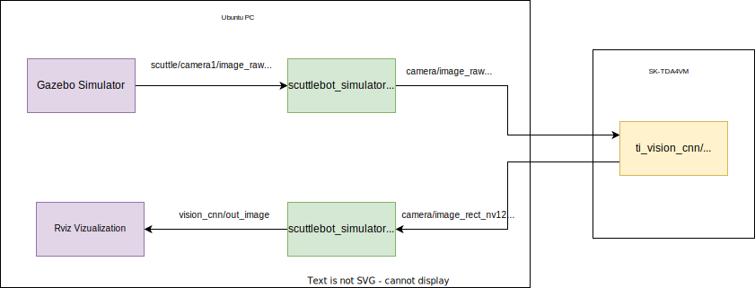
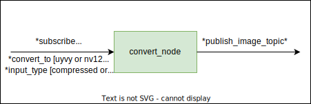

# Running Object detection and semantic segmentation on Scuttlebot Simulator using J7 SK Board

This sections covers the details on running scuttlebot simulator on gazebo and offloading camera frames to J7 SK Board for running Object detection and Semantic Segmentation.

**Note: Assuming the ROS, Gazebo, Turtlebot teleop and Scuttlebot is setup on Ubuntu PC**

## Backgorund

Before getting started, we must have some information on how this demo works. Once the scuttlebot is running on gazebo, it publishes RGB frames to a rostopic (In this case "scuttle/camera1/image_raw"). The frames are published in raw and in jpeg compressed format. The convert_node.cpp is a rosnode which converts rgb frames to either uyvy or nv12 (configurable) and republishes the converted frame. This is the input to ti_vision_cnn node on J7 SK Board running Object detection/Semantic segmantation. The result can be vizualized on Ubuntu PC using rviz launch files provided in scuttlebot_simulator package.

**Note: This package is general and can work with any and every entity publishing rgb images to a rostopic.**

<p align="center">
    
</p>

<p align="center"><b>Figure 1. Object detection on Scuttlebot Gazebo simulator</b></p>

## Details for convert_node

The convert node can convert rgb raw or jpeg compressed frames to uyvy/nv12/rgb frames.

| From | To  |
| :---:   | :-: |
| rgb_raw | uyvy |
| rgb_raw | nv12 |
| rgb_compressed | uyvy |
| rgb_compressed | nv12 |
| rgb_compressed | rgb_raw |

Following are the arguments that can be provided to the launch files.

| Args | Details  |
| :---:   | :-: |
| subscribe_topic | Input RGB rostopic |
| publish_topic | Output rostopic |
| convert_to | Convert to what format? [uyvy or nv12 or rgb] |
| input_type | is input raw or jpeg compressed [compressed or raw]|

<p align="center">
    
</p>

<p align="center"><b>Figure 1.Convert Node</b></p>


## Setting up UBUNTU PC

Please follow the instructions for [setting up docker cuntainer on UBUNTU PC](../../README.md).

### Starting docker container
``` shell
user@pc:$ cd ~/j7ros_home/ros_ws/src/edgeai-robotics-demos/docker
user@pc:~/j7ros_home/ros_ws/src/edgeai-robotics-demos/docker$ ./run_pc.sh
```

### Downloading aws-robomaker environments

``` shell
user@pc-docker:~/j7ros_home/ros_ws$ cd src
user@pc-docker:~/j7ros_home/ros_ws/src$ mkdir -p custom_worlds/src
user@pc-docker:~/j7ros_home/ros_ws/src$ cd custom_worlds/src
user@pc-docker:~/j7ros_home/ros_ws/src/custom_worlds/src$ git clone https://github.com/aws-robotics/aws-robomaker-hospital-world.git
user@pc-docker:~/j7ros_home/ros_ws/src/custom_worlds/src$ cd aws-robomaker-hospital-world
user@pc-docker:~/j7ros_home/ros_ws/src/custom_worlds/src/aws-robomaker-hospital-world$ rosdep install --from-paths . --ignore-src -r -y
user@pc-docker:~/j7ros_home/ros_ws/src/custom_worlds/src/aws-robomaker-hospital-world$ chmod +x setup.sh
user@pc-docker:~/j7ros_home/ros_ws/src/custom_worlds/src/aws-robomaker-hospital-world$ ./setup.sh
user@pc-docker:~/j7ros_home/ros_ws/src/custom_worlds/src/aws-robomaker-hospital-world$ cd ~/j7ros_home/ros_ws
```

This will download aws-robomaker-hospital-world and other dependencies and models.You can follow the same process for other aws-worlds

* [Hospital World](https://github.com/aws-robotics/aws-robomaker-hospital-world)
* [Warehouse World](https://github.com/aws-robotics/aws-robomaker-small-warehouse-world)
* [House World](https://github.com/aws-robotics/aws-robomaker-small-house-world)
* [Bookstore World](https://github.com/aws-robotics/aws-robomaker-bookstore-world)


### Building packages

Now we need to build all three packages. edgeai-robotics-demos, scuttle_ws and custom_worlds
``` shell
user@pc-docker:~/j7ros_home/ros_ws$ mkdir -p ros1_build && cd ros1_build
user@pc-docker:~/j7ros_home/ros_ws/ros1_build$ catkin_make --source ~/j7ros_home/ros_ws/src/edgeai-robotics-demos/ros1
user@pc-docker:~/j7ros_home/ros_ws/ros1_build$ catkin_make --source ~/j7ros_home/ros_ws/src/scuttle_ws
user@pc-docker:~/j7ros_home/ros_ws/ros1_build$ catkin_make --source ~/j7ros_home/ros_ws/src/custom_worlds
user@pc-docker:~/j7ros_home/ros_ws/ros1_build$ source devel/setup.bash
```

## Running Gazebo simulator with scuttlebot and convert node


<u><h3> Launching Simulator and publishing RGB image to ros topic </h3></u>
Using this launch file, start the gazebo simulator with scuttlebot and convert node that converts scuttlebot camera frames to uyvy or nv12 format.

``` shell
user@pc-docker:~/j7ros_home/ros_ws/ros1_build$ source devel/setup.bash
user@pc-docker:~/j7ros_home/ros_ws/ros1_build$ roslaunch scuttlebot_simulator scuttlebot_gazebo.launch
```

Following arguments can be given by the user to control various parameters.
| Args | Details | Default |
| :---:   | :-: | :-: |
| camera_height | Height of camera relative to scuttlebot | 1 |
| camera_name | Name given to camera | scuttle/camera1 |
| image_width | Width of image captured from scuttlebot camera | 1280 |
| image_height | Height of the image | 720 |
| subscribe_topic | Input RGB rostopic to convert node | scuttle/camera1/image_raw |
| publish_topic | Output rostopic from convert node | camera/image_raw |
| convert_to | uyvy or nv12 or rgb | nv12 |
| input_type | compressed or raw | raw |
| world | Aws World (hospital / warehouse / house / bookstore) | hospital |

Example Usage:

``` shell
user@pc-docker:~/j7ros_home/ros_ws/ros1_build$ roslaunch scuttlebot_simulator scuttlebot_gazebo.launch image_width:=800 image_height:=800 convert_to:=uyvy world:=warehouse
```

<u><h3>Driving Scuttlebot using Teleop Keyboard</h3></u>
<b>Open another terminal</b> and launch the dokcer container. Launch teleop_keyboard and drive around scuttlebot using wasd keys. The teleop_keyboard published Twist message to /cmd_vel according to user input.

``` shell
user@pc:~/j7ros_home/ros_ws$ sudo src/edgeai-robotics-demos/docker/run_pc.sh
user@pc-docker:~/j7ros_home/ros_ws$ cd ros1_build
user@pc-docker:~/j7ros_home/ros_ws/ros1_build$ source devel/setup.bash
user@pc-docker:~/j7ros_home/ros_ws/ros1_build$ roslaunch scuttlebot_simulator teleop_keyboard.launch
```


## Setting up J7 SK Board

Please follow the instructions in [this section in the User Guide Documentation](https://software-dl.ti.com/jacinto7/esd/robotics-sdk/08_02_00/docs/source/docker/README.html#setting-up-robotics-kit-environment) for setting up the environment to work with ROS1 on J7 SK board.

Run the ti_vision_cnn node for Object detection or Semantic Segmentation.

```shell
root@j7-docker:~/j7ros_home/ros_ws$ source devel/setup.bash
root@j7-docker:~/j7ros_home/ros_ws$ roslaunch ti_vision_cnn objdet_cnn.launch image_format:=1 enable_ldc_node:=0
```

image_format:=1 -> NV12\
image_format:=2 -> UYVY


## [Visualization on Ubuntu PC]
Use ti_viz_nodes under robotics_sdk to vizualize the output. [Robotics SDK](https://software-dl.ti.com/jacinto7/esd/robotics-sdk/08_02_00/docs/source/ros1/nodes/ti_vision_cnn/README_objdet.html).

```shell
user@pc-docker:~/j7ros_home/ros_ws$ source devel/setup.bash
user@pc-docker:~/j7ros_home/ros_ws$ roslaunch ti_viz_nodes rviz_objdet_cnn.launch
```

<p align="center">
  
</p>

## Documentation

Documentation on the SCUTTLE ROS library can be found at the following link:

* [Ros](http://wiki.ros.org/melodic)
* [Gazebo](https://classic.gazebosim.org/tutorials?tut=install_ubuntu) [Install gazebo9 for ubuntu18.04]
* [Turtlebot3](https://automaticaddison.com/how-to-launch-the-turtlebot3-simulation-with-ros/)
* [SCUTTLE ROS LIBRARY](https://github.com/scuttlerobot/SCUTTLE_ROS.git)

