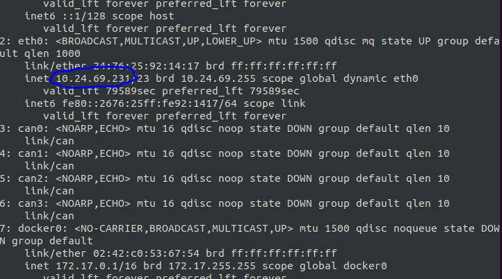

# Running OpenCV and EdgeAI Subject Follower on Scuttlebot Simulator

This section covers the details on running scuttlebot simulator on gazebo and offloading camera frames to J7 SK Board for running opencv_subject_follower and edgeai_subject_follower demos.


## Setting up UBUNTU PC

Before procedding , please follow the instructions for [setting up your UBUNTU PC for the first time](README.md).

## Run the gazebo simulator on UBUNTU PC

### Run the docker container
``` shell
user@pc:~/j7ros_home/ros_ws$ src/edgeai-robotics-demos/docker/run_pc.sh
```


### Setting up ROS Variables in Ubuntu PC
We need to setup ROS_MASTER_URI and ROS_IP. For this we need the ip adress of the PC. Use command <b>ip addr</b> to note the ip address.
``` shell
user@pc-docker:~/j7ros_home/ros_ws/ros1_build$ ip addr
```
<p align="center">
    
</p>

Now we can set the variables. <b>This needs to be done everytime we start a new session or new docker container</b>
``` shell
user@pc-docker:~/j7ros_home/ros_ws$ export ROS_MASTER_URI=http://<PC_IP_ADDR>:11311
user@pc-docker:~/j7ros_home/ros_ws$ export ROS_IP=<PC_IP_ADDR>
```

## Running Gazebo simulator with scuttlebot and convert node


``` shell
user@pc-docker:~/j7ros_home/ros_ws$ cd ros1_build
user@pc-docker:~/j7ros_home/ros_ws/ros1_build$ source devel/setup.bash
user@pc-docker:~/j7ros_home/ros_ws/ros1_build$ roslaunch scuttlebot_simulator scuttlebot_gazebo.launch convert_color:=false
```

<b>Setting convert_color param to false turns off the color convert node. In that case only RGB raw and jpeg compressed image is published from the scuttlebot camera. Since opencv_subject_follower and edgeai_subject_follower can handle RGB,NV12,UYVY and JPEG formats, conversion is not mandatory.</b> In case user still wants to user NV12 or UYVY format, do not set color_convert to false  


## Setting up J7 SK Board

Please follow the instructions in [this section to setup edgeai-robotics-demos on J7 SK Board](../../README.md) 

Run the edgeai-robotics-demos docker container
```shell
root@j7-sk:/opt/robot$ edgeai-robotics-demos/docker/run.sh
```

Since our Ubuntu PC runs the <b>roscore</b> we need to specify the ROS_MASTER_URI in the SK Board. Previously, we have already noted the ip adress of Ubuntu PC

```shell
root@j7-docker:~/j7ros_home/ros_ws$ export ROS_MASTER_URI=http://<PC_IP_ADDR>:11311
```

## 1) Running Opencv_Subject_Follower Demo

(In-depth details of opencv_subject_follower could be found under [OpenCV based ball follower](../../../python/apps/opencv_subject_follower/README.md).)

Before running the demo, we need to configure yaml files to specify some parameters. Open <b>/opt/robot/edgeai-robotics-demos/python/opencv_subject_follower/subject_follower.yaml</b> file and edit as follows.

* Set <b>source</b> to ros 
* Set <b>ros_input_topic</b> to appropriate topic to subscribe to. [By default the topic name published by scuttlebot camera is /scuttle/camera1/image_raw/and /scuttle/camera1/image_raw/compressed] [You can look all the topics using rostopic list command]
* Set <b>format</b> to appropriate format. [RGB,NV12,UYVY,JPEG]
* Set other parameters if required.

```shell
root@j7-docker:~/j7ros_home/ros_ws$ cd ros1_build
root@j7-docker:~/j7ros_home/ros_ws/ros1_build$ source devel/setup.bash
root@j7-docker:~/j7ros_home/ros_ws/ros1_build$ roslaunch opencv_subject_follower opencv_follower.launch
```

## 2) Running Edgeai_Subject_Follower Demo

(In-depth details of edgeai_subject_follower could be found under [EdgeAI based ball follower](../../../python/apps/edgeai_subject_follower/README.md).)

Before running the demo, we need to configure yaml files to specify some parameters. Open <b>/opt/robot/edgeai-robotics-demos/python/edgeai_subject_follower/process_config.yaml</b> file and edit if needed. A placeholder configuration has already been given in the file. Similarly you can change the subject_follower.yaml file in same folder for additional configurations.


```shell
root@j7-docker:~/j7ros_home/ros_ws$ cd ros1_build
root@j7-docker:~/j7ros_home/ros_ws/ros1_build$ source devel/setup.bash
root@j7-docker:~/j7ros_home/ros_ws$ roslaunch edgeai_subject_follower edgeai_follower.launch
```


## [Visualization on Ubuntu PC]
To visualize the output, we need yet another session running on the same docker container.
```shell
user@pc:~/j7ros_home/ros_ws$ sudo docker ps
``` 

Note the docker container id

```shell
user@pc:~/j7ros_home/ros_ws$ sudo docker exec -it <CONTAINER_ID> bash
user@pc-docker:~/j7ros_home/ros_ws$ export ROS_MASTER_URI=http://<PC_IP_ADDR>:11311
user@pc-docker:~/j7ros_home/ros_ws$ export ROS_IP=<PC_IP_ADDR>
```    

```shell
user@pc-docker:~/j7ros_home/ros_ws$ source devel/setup.bash
```

For opencv_subject_follower demo

```shell
user@pc-docker:~/j7ros_home/ros_ws$ rviz -d /root/j7ros_home/ros_ws/src/edgeai-robotics-demos/ros1/rviz/follower.rviz
```

For edgeai_subject_follower demo

```shell
user@pc-docker:~/j7ros_home/ros_ws$ rviz -d /root/j7ros_home/ros_ws/src/edgeai-robotics-demos/ros1/rviz/follower.rviz
```

