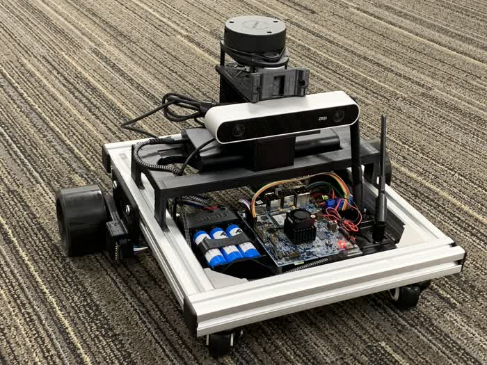

Vision 3D Perception
====================


<br />

This vision based 3D perception demo on the Scuttle robot showcases optimized AI capability and hardware-accelerated stereo vision processing built-in on TDA4VM, which are combined to provide 3D perception for mobile robots. Referring to Figure 1, the 3D perception demo consists of several ROS nodes:

1. `zed_capture` node takes stereo camera raw images from the ZED camera
2. `ti_sde` node is a pipeline for stereo vision processing
3. `ti_vision_cnn` node does CNN 2D object detection (with YOLO, SSD, or any other detection model of choice from the Edge AI model zoo)
4. Followed by `ti_objdet_range` that takes the outputs from the two processing chains, calculates and associates XYZ spatial information to each of detected 2D bounding boxes, and also scans the stereo disparity map horizontally and publishes the XYZ point-cloud. This point-cloud data provides spatial information for potential obstacles that the CNN object detection model may not able to detect (e.g, wall or structure of buildings).
5. Scuttle robot is controlled with a gamepad controller.
6. Rivz visualization is on a remote Ubuntu PC over WiFi connectivity.


<figcaption>Figure 1. Vision based 3D perception on the Scuttle robot: block diagram</figcaption>
<br />

Most of the ROS nodes (`zed_capture`, `ti_sde`, `ti_vision_cnn`, and `ti_objdet_range`) are part of Robotics SDK 8.2. For more details, please refer to [the SDK documentation](https://software-dl.ti.com/jacinto7/esd/robotics-sdk/08_02_00/docs/index.html).

## Hardware Requirements


<figcaption>Figure 2. TDA4VM runs the Scuttle robot</figcaption>
<br />

- Scuttle robot with gamepad controller
- TDA4VM SK Board
- ZED or ZED2 stereo camera
- Intel Wireless-AC 9260 M.2 WiFi module, and antenna
- WiFi router that supports 802.11ac in 5GHz band
- Battery pack with USB Type-C output to power the TDA4VM SK Board

## Software Setup

1. **Install the Prerequisites**: Run the following script on the TDA4VM host Linux.
    ```
    root@tda4vm-sk:~# /opt/robot/edgeai-robotics-demos/scripts/setup_script.sh
    ```
1. **Docker Environment Setting**: Follow instruction in [this section](../../README.md).
1. **Generating Camera Parameter Files for ZED Camera**: Follow [`zed_capture` section of the Robotics SDK](https://software-dl.ti.com/jacinto7/esd/robotics-sdk/08_02_00/docs/source/ros1/drivers/zed_capture/README.html). Resulting .yaml and .bin files for a particular serial number of the ZED camera being used should be copied (using e.g., `scp` command) to the TDA4 host Linux filesystem under `/opt/robotics_skd/ros1/driver/zed_capture/config`.
1. **Configure the WiFi Module in Station Mode on TDA4VM**: Follow [the WiFi section of Edge AI SDK documentation](https://software-dl.ti.com/jacinto7/esd/processor-sdk-linux-sk-tda4vm/08_02_00/exports/docs/wifi_oob_demo.html#using-the-board-as-wifi-station-to-connect-to-external-wifi-ap). Please note that the WiFi should be configured **in station mode** to have enough bandwidth. In summary, modify `/usr/share/intel9260/wificfg` and reboot the TDA4VM SK board: for example if you want to connect to a WiFi router named `MyHomeWifi` with `Password123` password, the content should be as shown below: as follows:
    ```
    # This file is used for configuring the credentials required when the
    # board is acting as a WiFi station.
    # Customize this as per your need
    # Set the demo_enable to yes so that the board connects to the AP automatically
    # after the boot

    [Wifi-STA]
    sta_enable = yes
    ssid = MyHomeWifi
    password = Password123
    ```
1. IP address reported with “ifconfig” is used in the "docker run" script. In WiFi station mode, “ifconfig” currently reports a wrong IP address. A workaround is running “`udhcpc -i wlp1s0`” before running `/opt/robot/edgeai-robotics-demos/docker/run.sh`.

## How to Build and Run the Demo in the Docker Container


**[TDA4]**

To build the demo, in the Docker container
```
catkin_make -j1 --source /opt/robotics_sdk/ros1
catkin_make -j1 --source /opt/robot/edgeai-robotics-demos/ros1
catkin_make --source /opt/robot/scuttle_ws
source devel/setup.bash
```

To run the demo, launch the following launch file in the Docker container.

```
roslaunch vision_3d_perception scuttle_objdet_range.launch zed_sn:=SNxxxxx
```
where `xxxxx` is the serial number of the ZED camera being used.


**[Visualization on Ubuntu PC]**

ROS network setting: We need to set up two environment variables which will be passed to the Docker container and then used in configuring ROS network settings. Please update the following two lines in `setup_env_pc.sh`:
```
export J7_IP_ADDR=<J7_IP_address>
export PC_IP_ADDR=<PC_IP_address>
```
Then, `source setup_env_pc.sh` before running `docker_run_ros1.sh`.

Launch the following launch file in the remote PC ROS1 Docker container.
```
roslaunch ti_viz_nodes rviz_objdet_range.launch
```